Kaggle日記： 2021年8月3日～9日
===============================

2021年8月2日から開催されたKaggle公式「[30 Days of ML](https://www.kaggle.com/thirty-days-of-ml)」プログラムに沿って、最初の1週間で、

-講座「 [Learn Python Tutorials | Kaggle](https://www.kaggle.com/learn/python)」

を受講して終了しました。本日記はそのときのログです。

修了証
----------------------------------------

- [I've completed the Python course on Kaggle!](https://www.kaggle.com/learn/certification/isshiki/python)

  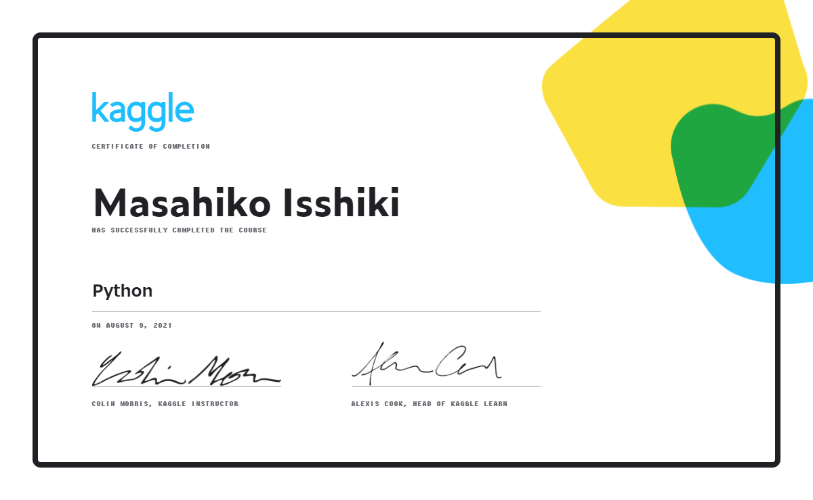

Kaggle’s 30 Days of ML Daily Assignments
----------------------------------------

リンクはカットしました。

### Day 1: 8/3

- [Follow the instructions in this notebook](https://www.kaggle.com/alexisbcook/getting-started-with-kaggle) to get started with Kaggle
- Join 30 Days of ML Discord Community and introduce yourself in the #introductions channel

### Day 2: 8/4

- Read this tutorial (from Lesson 1 of the Python course)
- Complete this exercise (from Lesson 1 of the Python course)

### Day 3: 8/5

- Read this tutorial (from Lesson 2 of the Python course)
- Complete this exercise (from Lesson 2 of the Python course)

### Day 4: 8/6

- Read this tutorial (from Lesson 3 of the Python course)
- Complete this exercise (from Lesson 3 of the Python course)

### Day 5: 8/7

- Read this tutorial (from Lesson 4 of the Python course)
- Complete this exercise (from Lesson 4 of the Python course)
- Read this tutorial (from Lesson 5 of the Python course)
- Complete this exercise (from Lesson 5 of the Python course)

### Day 6: 8/8

- Read this tutorial (from Lesson 6 of the Python course)
- Complete this exercise (from Lesson 6 of the Python course)

### Day 7: 8/9

- Read this tutorial (from Lesson 7 of the Python course)
- Complete this exercise (from Lesson 7 of the Python course)

### Python Cource

勉強した内容を図にまとめたツイートを見付けました。

- [AI Day](https://twitter.com/AIDay95390248)

履修内容を簡単に思い出しやすいように、上記の図を以下に引用しています。

- :arrow_down_small:図解：簡単に読めるPythonコード（画像の引用元：<https://twitter.com/AIDay95390248/status/1423035277489184774>）
  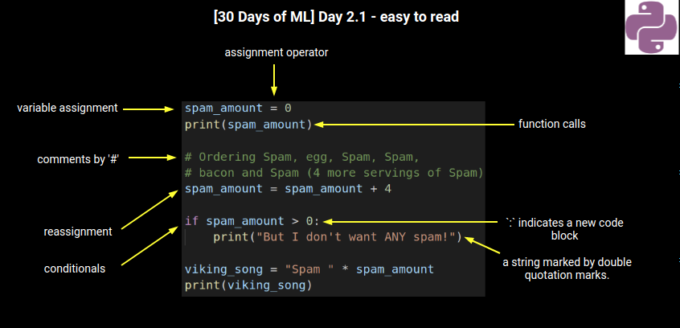

- :arrow_down_small:図解：数値と算術（画像の引用元：<https://twitter.com/AIDay95390248/status/1423035281280749572>）
  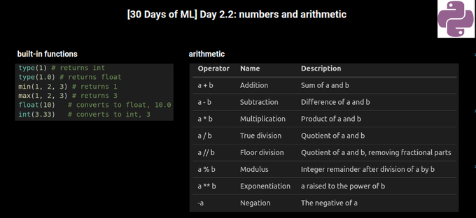

- :arrow_down_small:図解：関数とヘルプ取得（画像の引用元：<https://twitter.com/AIDay95390248/status/1423420821230559232>）
  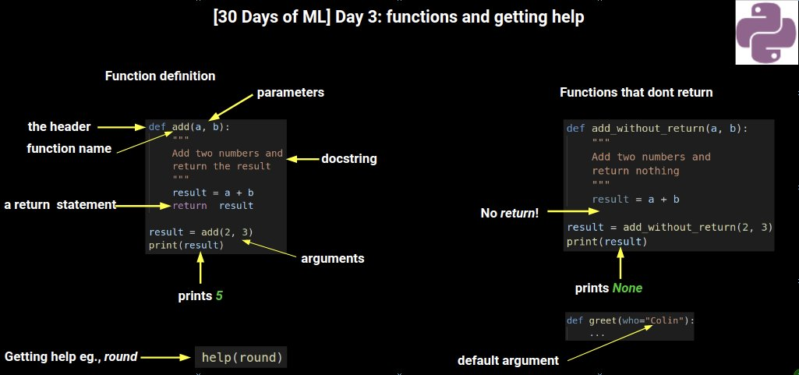

- :arrow_down_small:図解：真偽値（画像の引用元：<https://twitter.com/AIDay95390248/status/1423761634200375301>）
  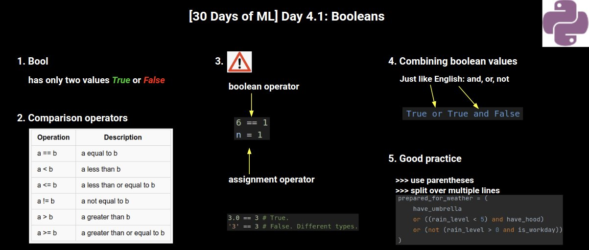

- :arrow_down_small:図解：条件文（画像の引用元：<https://twitter.com/AIDay95390248/status/1423764629973520388>）
  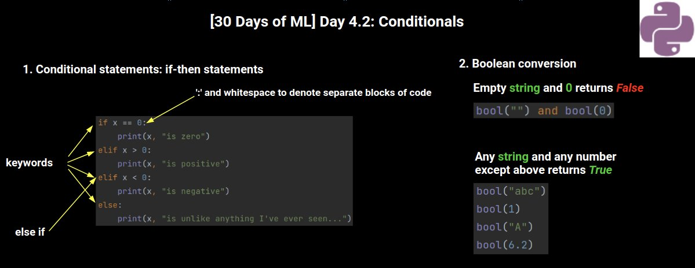

- :arrow_down_small:図解：リスト操作 1（画像の引用元：<https://twitter.com/AIDay95390248/status/1424120246105948172>）
  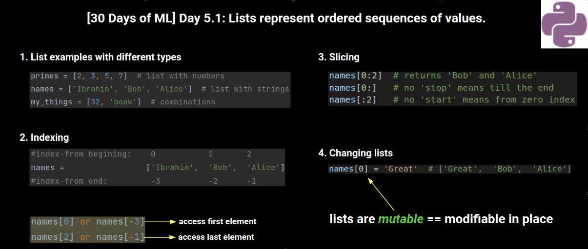

- :arrow_down_small:図解：リスト操作 2（画像の引用元：<https://twitter.com/AIDay95390248/status/1424120251776741384>）
  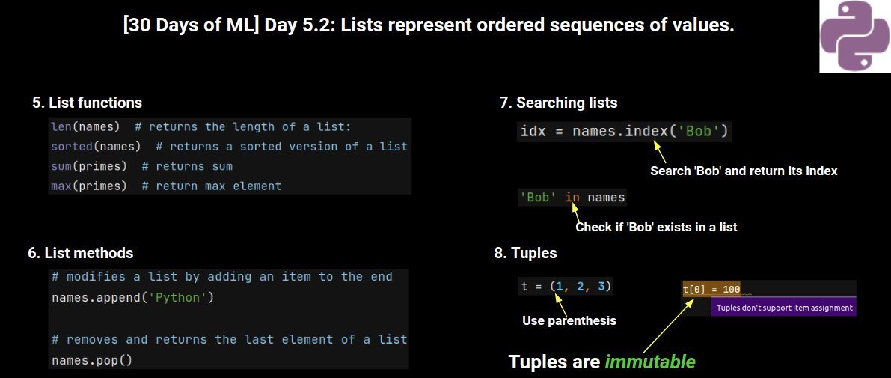

- :arrow_down_small:図解：繰り返し処理（画像の引用元：<https://twitter.com/AIDay95390248/status/1424144806154997760>）
  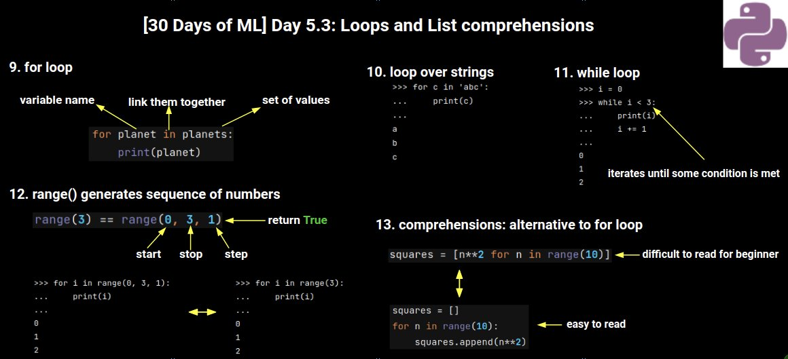

- :arrow_down_small:図解：文字列（画像の引用元：<https://twitter.com/AIDay95390248/status/1424487728377380864>）
  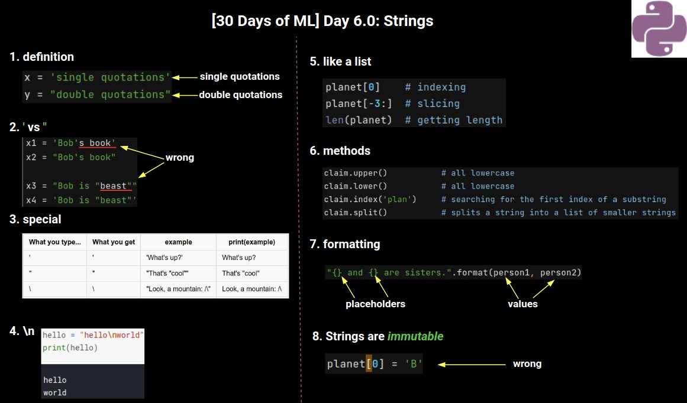

- :arrow_down_small:図解：文字列（画像の引用元：<https://twitter.com/AIDay95390248/status/1424487728377380864>）
  

- :arrow_down_small:図解：辞書（画像の引用元：<https://twitter.com/AIDay95390248/status/1424497606839918593>）
  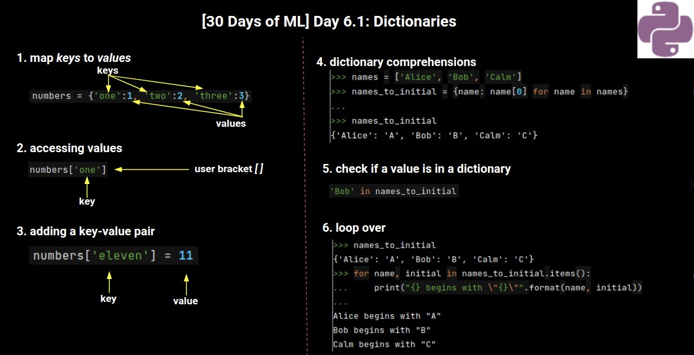

- :arrow_down_small:図解：インポート（画像の引用元：<https://twitter.com/AIDay95390248/status/1424839510811201538>）
  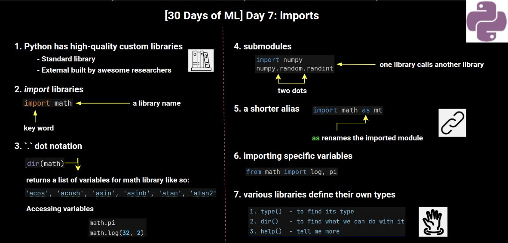
