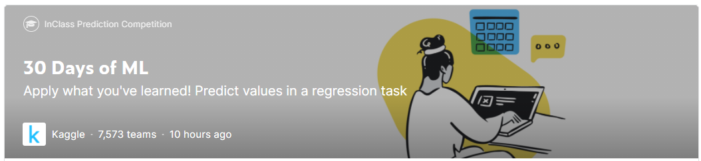
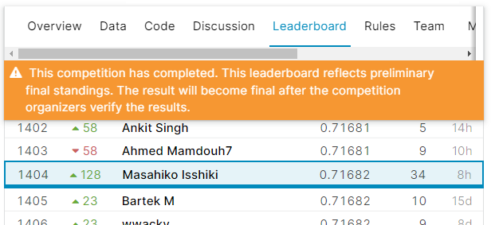
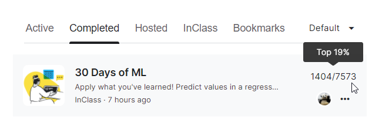
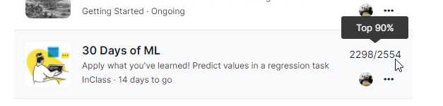

Kaggle日記（2021年8月18日、24日～31日）： コンペ「30 Days of ML」
================================================================

- コンペ「[30 Days of ML | Kaggle](https://www.kaggle.com/c/30-days-of-ml)」

Kaggle公式講座への参加者のために用意された回帰問題コンペです。

- [Kaggle日記（2021年8月18日、24日～31日）： コンペ「30 Days of ML」](#kaggle日記2021年8月18日24日31日-コンペ30-days-of-ml)
  - [目標](#目標)
  - [最終結果（Final Score）](#最終結果final-score)
  - [振り返り](#振り返り)
    - [:grinning:良かった点](#grinning良かった点)
    - [:cry:悪かった点](#cry悪かった点)
  - [方針](#方針)
  - [記事化](#記事化)
  - [作業履歴](#作業履歴)
    - [[20210818] :smile: 初回提出。これをベースラインに](#20210818-smile-初回提出これをベースラインに)
      - [:book: [v1：Baseline]【0.73845】(2294／2254：Top 90％) Notebook Getting Started with 30 Days of ML Competition | Model v1](#book-v1baseline07384522942254top-90-notebook-getting-started-with-30-days-of-ml-competition--model-v1)
    - [[20210824] :full_moon_with_face:2回目提出。Azure AutoMLを試した](#20210824-full_moon_with_face2回目提出azure-automlを試した)
      - [:+1: [v2：Improved]【0.72252】(2391／5350：Top 45％) Azure AutoML - no-1 StackEnsemble | Model v2.9](#1-v2improved07225223915350top-45-azure-automl---no-1-stackensemble--model-v29)
    - [[20210828]:full_moon_with_face:3回目提出。XGBoostを試した](#20210828full_moon_with_face3回目提出xgboostを試した)
      - [:+1: [v3：Improved]【0.72138】(2655／6406：Top 42％) Notebook v3 - XGBoost | Model v3.1](#1-v3improved07213826556406top-42-notebook-v3---xgboost--model-v31)
    - [[20210829]:astonished:4～5回目提出。前処理を試した](#20210829astonished45回目提出前処理を試した)
      - [:point_right: [v4：NotChanged]【0.72241】(-) Notebook 30 Days -v4 - Feature Engineering Model v4.0](#point_right-v4notchanged072241--notebook-30-days--v4---feature-engineering-model-v40)
      - [:point_right: [v5：NotChanged]【0.72256】(-) Notebook 30 Days -v5- Target encoding | Model v5.0](#point_right-v5notchanged072256--notebook-30-days--v5--target-encoding--model-v50)
    - [[20210830]:full_moon_with_face:6回目提出。ハイパーパラメーターチューニングを試した](#20210830full_moon_with_face6回目提出ハイパーパラメーターチューニングを試した)
      - [:+1: [v6：Improved]【0.71903】(1536／6878：Top 23％) Notebook 30 Days -v6- Hyperparameter tuning | Model v6.8](#1-v6improved07190315366878top-23-notebook-30-days--v6--hyperparameter-tuning--model-v68)
    - [[20210831]:full_moon_with_face:7～8回目提出。Model Blending／Stackingを試した](#20210831full_moon_with_face78回目提出model-blendingstackingを試した)
      - [:+1: [v7：Improved]【0.71871】(1389／6878：Top 20％) Notebook 30 Days -v7- Model Blending | Model v7.0](#1-v7improved07187113896878top-20-notebook-30-days--v7--model-blending--model-v70)
      - [:point_right: [v8：NotChanged]【0.71872】(-) Notebook 30 Days -v8- Model Stacking | Model v8.1](#point_right-v8notchanged071872--notebook-30-days--v8--model-stacking--model-v81)
  - [作業履歴（コンテスト後の復習）](#作業履歴コンテスト後の復習)

目標
----------------------------------------

トップ10に入り、Swag（景品）をゲットする。

最終結果（Final Score）
----------------------------------------

- Public Score： 0.71871（1532位）
- Private Score： 0.71682（1404位、＋128位分上昇）

残念ながら、全く届かず。7573人中の1404位。

トップ19％にはなりました。

振り返り
----------------------------------------

### :grinning:良かった点

- 初のコンペ参加で、そこまで悪くなく、まずまずかもしれません。ということで納得しておきます。
- ハイパーパラメーターチューニングが非常に有効でした。

### :cry:悪かった点

- 学びに重点を置いたので、それに時間をかけてしまい、戦略的に精度向上に励めていなかったのも、目標を達成できなかった原因かもと思います。具体的にはEDAなどで特徴量をもっと精査できるがしていない点が挙げられます。
- Discussionを一切読みませんでした。結果が出た後で、しっかりと読み込み、次に生かそうと思います。

方針
----------------------------------------

- 「[Abhishek Thakur氏のYouTube講座「Kaggle's 30 Days of ML」のCompetition Part-1～7 ](https://www.youtube.com/playlist?list=PL98nY_tJQXZnP-k3qCDd1hljVSciDV9_N)」の内容に合わせて、学びながら進め、少しずつ改善していく。それに合わせて少しずつ精度向上させたい。
- 誰でも真似できる内容にして、記事化につなげたい。

記事化
----------------------------------------

- 連載タイトル：『僕たちのKaggle挑戦記』（共著）
- 記事タイトル：「Kaggleで学ぶハイパラ自動調整、モデルのBlendingとStacking」（仮）

1週間かけて実践した内容を、Kaggle入門（Part2）の参考例として解説する記事にしたい。

Kaggle初心者用コンペで、私が最初にやったことが他の人のヒントになるのではないかと思う。

- 連載コンセプト：肩肘を張らずに、体験して成功して学んだオススメポイントから、失敗して悟ったアンチパターン、実践で役立ちそうなちょっとしたTipsまでを、Deep Insider編集部の一色と川崎を中心に記事化していく。

作業履歴
----------------------------------------

### [20210818] :smile: 初回提出。これをベースラインに

#### :book: [v1：Baseline]【0.73845】(2294／2254：Top 90％) Notebook Getting Started with 30 Days of ML Competition | Model v1

### [20210824] :full_moon_with_face:2回目提出。Azure AutoMLを試した

- 戦略：前のコンペでそれなり成果が出たAutoMLをまずは試す

#### :+1: [v2：Improved]【0.72252】(2391／5350：Top 45％) Azure AutoML - no-1 StackEnsemble | Model v2.9

- 取りあえず上位10個のSubmissionをしてみた結果の最上位のものがこれ

- 試したいアイデア：
  - シンプルにXGBoostを組む。
    - → v3で実施
  - シンプルにLightGBMを組む。参考：[TPS_Feb_2021_LGBM_Simple_Version | Kaggle](https://www.kaggle.com/svyatoslavsokolov/tps-feb-2021-lgbm-simple-version)
    - → 時間が足りずできていない

### [20210828]:full_moon_with_face:3回目提出。XGBoostを試した

#### :+1: [v3：Improved]【0.72138】(2655／6406：Top 42％) Notebook v3 - XGBoost | Model v3.1

- 下記動画の内容そのまま
- 動画：[Kaggle's 30 Days Of ML (Competition Part-1): Cross Validation & First Submission on Kaggle - YouTube](https://www.youtube.com/watch?v=t5fhRP62YdE&list=PL98nY_tJQXZnP-k3qCDd1hljVSciDV9_N&index=19)

### [20210829]:astonished:4～5回目提出。前処理を試した

#### :point_right: [v4：NotChanged]【0.72241】(-) Notebook 30 Days -v4 - Feature Engineering Model v4.0

- 下記動画の内容そのまま
- 動画：[Kaggle's 30 Days Of ML (Competition Part-2): Feature Engineering (Categorical & Numerical Variables) - YouTube](https://www.youtube.com/watch?v=tx3FoYdiFwA&list=PL98nY_tJQXZnP-k3qCDd1hljVSciDV9_N&index=21)

#### :point_right: [v5：NotChanged]【0.72256】(-) Notebook 30 Days -v5- Target encoding | Model v5.0

- 下記動画の内容そのまま
- 動画：[Kaggle's 30 Days Of ML (Competition Part-3): What is Target Encoding and how does it work? - YouTube](https://www.youtube.com/watch?v=2Yx2Y545yBk&list=PL98nY_tJQXZnP-k3qCDd1hljVSciDV9_N&index=21)

### [20210830]:full_moon_with_face:6回目提出。ハイパーパラメーターチューニングを試した

#### :+1: [v6：Improved]【0.71903】(1536／6878：Top 23％) Notebook 30 Days -v6- Hyperparameter tuning | Model v6.8

- 下記動画の内容そのまま＋3つの結果をアンサンブル
- 動画：[Kaggle's 30 Days Of ML (Competition Part-4): Hyperparameter tuning using Optuna - YouTube](https://www.youtube.com/watch?v=m5YSKPMjkrk&list=PL98nY_tJQXZnP-k3qCDd1hljVSciDV9_N&index=22)
- 過去の5種類でハイパーパラメーターチューニングを行った
  - 6.8   XGBoost - Target encoding
  - 6.9   RandomForest
  - 6.10  XGBoost - Standardization version
  - 6.11  XGBoost - Polynomial and interaction features version
  - 6.12  XGBoost - One-hot endoding version

### [20210831]:full_moon_with_face:7～8回目提出。Model Blending／Stackingを試した

#### :+1: [v7：Improved]【0.71871】(1389／6878：Top 20％) Notebook 30 Days -v7- Model Blending | Model v7.0

- 下記動画の内容そのまま
- 動画：[Kaggle's 30 Days Of ML (Competition Part-5): Model Blending 101 - YouTube](https://www.youtube.com/watch?v=ISZYWtvoCAc&list=PL98nY_tJQXZnP-k3qCDd1hljVSciDV9_N&index=23)
- 上記6.8～6.12を線形回帰でModel Blendingした

#### :point_right: [v8：NotChanged]【0.71872】(-) Notebook 30 Days -v8- Model Stacking | Model v8.1

- 下記動画の内容そのまま
- 動画：[Kaggle's 30 Days Of ML (Competition Part-6): Model Stacking - YouTube](https://www.youtube.com/watch?v=pasJQ-IMm5w&list=PL98nY_tJQXZnP-k3qCDd1hljVSciDV9_N&index=24)
- 上記6.8～6.12をLevel 0として、その結果をLevel 1としてXGBoostとランダムフォレストと勾配ブースティング（回帰用）で、さらにその結果をLevel 2として線形回帰で、Model Stackingした
[30 Days of ML | Kaggle](https://www.kaggle.com/c/30-days-of-ml/discussion/267931)

作業履歴（コンテスト後の復習）
----------------------------------------

まだ勉強できていない...。

- [1st Place Solution](https://www.kaggle.com/c/30-days-of-ml/discussion/269541)
- 