Kaggle日記（2021年8月13日～18日、おまけ：20日）： コンペ「Housing Prices Competition for Kaggle Learn Users」
=============================================================================================================

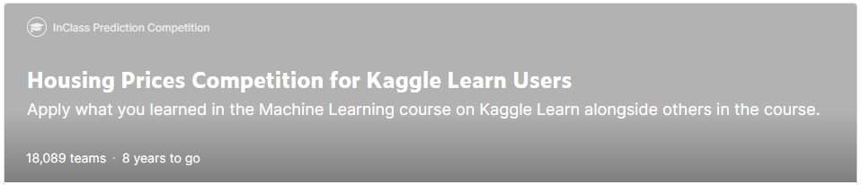

- コンペ「[Housing Prices Competition for Kaggle Learn Users | Kaggle](https://www.kaggle.com/c/home-data-for-ml-course)」

Kaggle公式講座への参加者のために用意された住宅価格コンペです。

- [Kaggle日記（2021年8月13日～18日、おまけ：20日）： コンペ「Housing Prices Competition for Kaggle Learn Users」](#kaggle日記2021年8月13日18日おまけ20日-コンペhousing-prices-competition-for-kaggle-learn-users)
  - [目標](#目標)
  - [最終結果（Final Score）](#最終結果final-score)
  - [途中経過（My Submissions）](#途中経過my-submissions)
  - [リソース](#リソース)
  - [方針](#方針)
  - [記事化](#記事化)
  - [振り返り](#振り返り)
    - [:grinning:良かった点](#grinning良かった点)
    - [:cry:悪かった点](#cry悪かった点)
  - [作業履歴](#作業履歴)
    - [[20210813] :smile: 初回提出。これをベースラインに](#20210813-smile-初回提出これをベースラインに)
      - [:book: [v1：Baseline]【21217.91639】(12143／13499：Top 90％) Notebook Intro ML Course Exercise 6 of 6 | Version 1](#book-v1baseline21217916391214313499top-90-notebook-intro-ml-course-exercise-6-of-6--version-1)
    - [[20210814] :relieved:2回目提出。ランダムフォレストを改善した](#20210814-relieved2回目提出ランダムフォレストを改善した)
      - [:+1: [v2：Improved]【20998.83780】(9002／13569：Top 67％) Notebook Intermediate ML Course Exercise 1 of 7 | Version 2](#1-v2improved2099883780900213569top-67-notebook-intermediate-ml-course-exercise-1-of-7--version-2)
    - [[20210815] :laughing:3回目提出。欠損値がある列を処理して、より多くの特徴量を使った](#20210815-laughing3回目提出欠損値がある列を処理してより多くの特徴量を使った)
      - [:+1: [v3：Improved]【16766.44379】(7030／14393：Top 49％) Notebook Intermediate ML Course Exercise 2 of 7 | Version 3](#1-v3improved1676644379703014393top-49-notebook-intermediate-ml-course-exercise-2-of-7--version-3)
    - [[20210816] :cry:4回目提出。カテゴリ変数の列を処理した](#20210816-cry4回目提出カテゴリ変数の列を処理した)
      - [:-1: [v4：Worsened]【17471.74584】(-) Notebook Intermediate ML Course Exercise 3 of 7 | Version 4](#-1-v4worsened1747174584--notebook-intermediate-ml-course-exercise-3-of-7--version-4)
    - [[20210817] :cry:5回目提出。パイプラインを仕様して結線値とカテゴリ変数の前処理をまとめた](#20210817-cry5回目提出パイプラインを仕様して結線値とカテゴリ変数の前処理をまとめた)
      - [:point_right: [v5：NotChanged]【16721.95257】(9955／17145：Top 59％) Notebook Intermediate ML Course Exercise 4 of 7 | Version 5](#point_right-v5notchanged1672195257995517145top-59-notebook-intermediate-ml-course-exercise-4-of-7--version-5)
    - [[20210818] :smile:6回目提出。交差検証を適用した](#20210818-smile6回目提出交差検証を適用した)
      - [:+1: [v6：Improved]【16241.51793】(1246／17661：Top 8％) Notebook Intermediate ML Course Exercise 5 of 7 | Version 6](#1-v6improved1624151793124617661top-8-notebook-intermediate-ml-course-exercise-5-of-7--version-6)
    - [[20210818] :astonished:7回目提出。アンサンブル学習を適用した](#20210818-astonished7回目提出アンサンブル学習を適用した)
      - [:+1: [v7：Improved]【14964.89501】(486／17719：Top 3％) Notebook Intermediate ML Course Exercise 6 of 7 | Version 7](#1-v7improved149648950148617719top-3-notebook-intermediate-ml-course-exercise-6-of-7--version-7)
    - [[20210818] :astonished:目標達成のため提出なし。データ漏えいの問題を学んだ](#20210818-astonished目標達成のため提出なしデータ漏えいの問題を学んだ)
    - [[20210820] :man_playing_handball:［おまけ］最終提出。清書し直して、前処理をもう少しちゃんと書いたうえで、Azure AutoMLの結果をアンサンブルで出力した](#20210820-man_playing_handballおまけ最終提出清書し直して前処理をもう少しちゃんと書いたうえでazure-automlの結果をアンサンブルで出力した)
      - [:+1: [v8：Improved]【14093.71916】(128／18798：Top 1％) Notebook Final model of the house price compe | Version 8](#1-v8improved140937191612818798top-1-notebook-final-model-of-the-house-price-compe--version-8)
  - [［おまけ］Azure AutoMLを使いこなす](#おまけazure-automlを使いこなす)

目標
----------------------------------------

トップ5％以内に入る。

最終結果（Final Score）
----------------------------------------

トップ3％以内に入った。※期限なしのコンペなので順位は常に変化します。

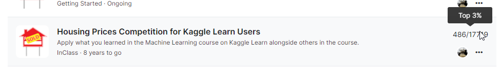

- Public Score： 14964.89501
- Private Score： -なし-

おまけとしてAutoML手法も加えることでトップ1％にも到達した。

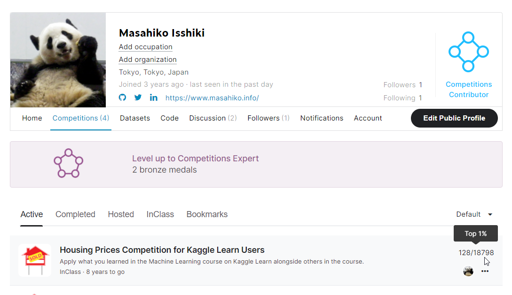

- Public Score： 14093.71916
- Private Score： -なし-

途中経過（My Submissions）
----------------------------------------

 Kaggle公式講座「Intermediate Machine Learning」の履修に合わせて、1日ずつ内容を更新して提出（Submission）していき、ほぼそのたびに精度改善できました。

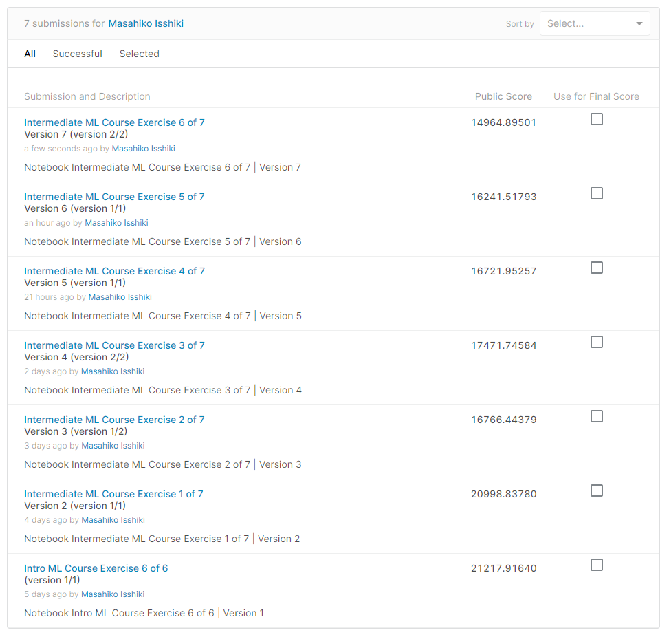

リソース
----------------------------------------

Kaggleによる公式プログラムと公式講座に沿って、本コンペに参加しました。参加のために勉強した内容は、下記のそれぞれのページ内にまとめています。

- 2021年8月2日～31日で開催のKaggle公式「[30 Days of ML](https://www.kaggle.com/thirty-days-of-ml)」プログラム
- [Kaggle日記（2021年8月3日～9日）： Kaggle公式講座「Python」の履修](https://github.com/isshiki/KaggleDiaryLog/blob/main/courses/python/Diary.md)
- [Kaggle日記（2021年8月10日～13日）： Kaggle公式講座「Intro to Machine Learning」の履修](https://github.com/isshiki/KaggleDiaryLog/blob/main/courses/intro-to-machine-learning/Diary.md)
- [Kaggle日記（2021年8月14日～18日）： Kaggle公式講座「Intermediate Machine Learning」の履修](https://github.com/isshiki/KaggleDiaryLog/blob/main/courses/intermediate-machine-learning/Diary.md)

方針
----------------------------------------

講座内容に合わせて、少しずつ改善していく。それに合わせて少しずつ精度向上させたい。

誰でも真似できる内容にして、記事化につなげたい。

記事化
----------------------------------------

- 連載タイトル：『Kaggle挑戦記』（仮、共著）
- 記事タイトル：「初めてのKaggleコンペ参戦。オススメの始め方」（仮）

1週間かけて実践した内容を、Kaggle入門の参考例として解説する記事にしたい。

Kaggleの最初の学習用コンペで、私が最初にやったことが他の人のヒントになるのではないかと思う。

- 連載コンセプト：肩肘を張らずに、体験して成功して学んだオススメポイントから、失敗して悟ったアンチパターン、実践で役立ちそうなちょっとしたTipsまでを、Deep Insider編集部の一色と川崎を中心に記事化していく。

振り返り
----------------------------------------

### :grinning:良かった点

- 講座内の範囲だけでもすれなりの順位になった
- アンサンブル学習が非常に有効だった

### :cry:悪かった点

- もっと改善できる点がある。EDAなどで特徴量をもっと精査できるがしていない
- Discussionを一切、見てない。見るといろいろなヒントがあるはず

作業履歴
----------------------------------------

### [20210813] :smile: 初回提出。これをベースラインに

#### :book: [v1：Baseline]【21217.91639】(12143／13499：Top 90％) Notebook Intro ML Course Exercise 6 of 6 | Version 1

- Kaggle講座「[Intro to Machine Learning: 7 of 7： Machine Learning Competitions](https://www.kaggle.com/alexisbcook/machine-learning-competitions)」の演習問題そのまま。
- ここから改善していく。
  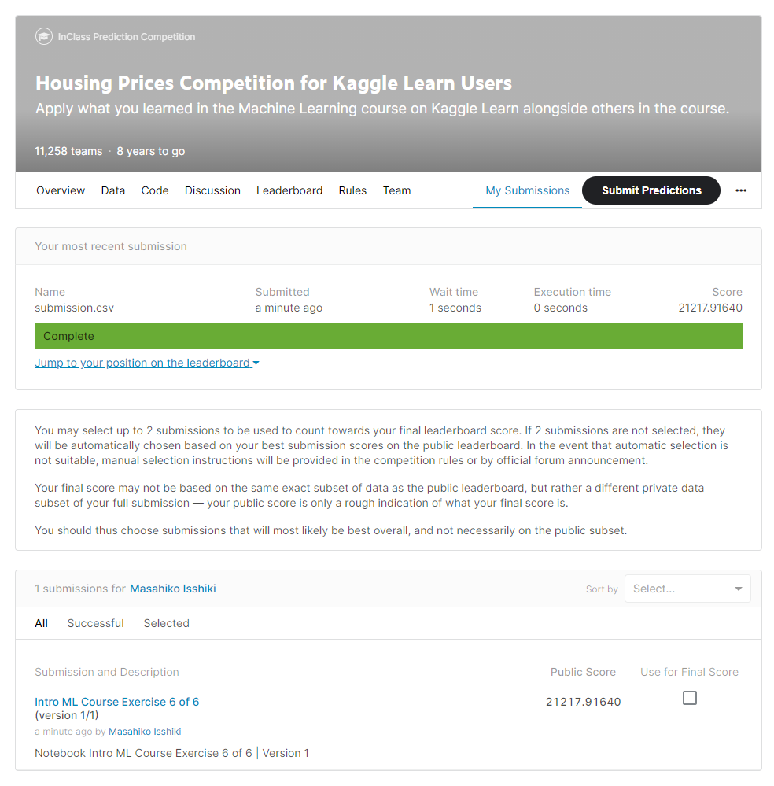

### [20210814] :relieved:2回目提出。ランダムフォレストを改善した

- 戦略：ランダムフォレストのパラメーターを変えた**モデルをいくつか作り、最適なモデルを選ぶ**。

  ```python
  from sklearn.ensemble import RandomForestRegressor

  model_1 = RandomForestRegressor(n_estimators=50, random_state=0)
  model_2 = RandomForestRegressor(n_estimators=100, random_state=0)
  model_3 = RandomForestRegressor(n_estimators=100, criterion='mae', random_state=0)
  model_4 = RandomForestRegressor(n_estimators=200, min_samples_split=20, random_state=0)
  model_5 = RandomForestRegressor(n_estimators=100, max_depth=7, random_state=0)
  ```

#### :+1: [v2：Improved]【20998.83780】(9002／13569：Top 67％) Notebook Intermediate ML Course Exercise 1 of 7 | Version 2

- Kaggle講座「[Intermediate Machine Learning: 1 of 7： Introduction](https://www.kaggle.com/alexisbcook/introduction)」の演習問題そのまま。

- ランダムフォレストのパラメーターを変えたモデルをいくつか作り、最適なモデルを選んだ。上記の中で一番精度が良かったmodel_3を使った。

- 試したいアイデア：
  1. より多くの特徴量を使いたい。
    →　講座の次が「欠損値」で、次が「カテゴリー変数」なので、より多くの特徴量が使えるようになるはず。

<!--
- チーム内のコメント：
  1. 川崎：ほにゃほにゃ
    →　一色：いいね！
-->

### [20210815] :laughing:3回目提出。欠損値がある列を処理して、より多くの特徴量を使った

- 戦略：**欠損値の前処理：**
  1. 欠損値のある変数列そのものをドロップする
  2. 補完（impute）する
  3. 補完したうえで「他の有無」を新たな列に追加して拡張する

- :arrow_down_small:図解：欠損値の前処理戦略（画像の引用元：<https://twitter.com/AIDay95390248/status/1426990935368478727>）
  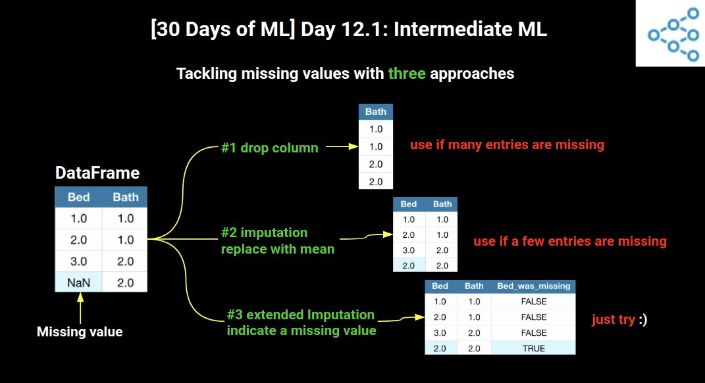

- 調査結果：**ある特徴で、何％ぐらいの欠損値なら許容できるか？**
  - 資料：[What percentage of missing data is acceptable? – Mvorganizing.org](https://www.mvorganizing.org/what-percentage-of-missing-data-is-acceptable/)
  1. 10％を超える欠損値がある分析では、バイアスが発生する可能性がある
  2. 40％を超える欠損値がある分析では、仮説的なデータであると考慮すべき
  3. 理論的には、20～25％が許容されうる最大の欠損値で、それを超えると分析から特徴量変数をドロップ（削除）するのを検討したい
  - 結論としては、**20％を超える欠損値がある**特徴量変数は、基本的にドロップすることを検討すればよいかな

#### :+1: [v3：Improved]【16766.44379】(7030／14393：Top 49％) Notebook Intermediate ML Course Exercise 2 of 7 | Version 3

- Kaggle講座「[Intermediate Machine Learning: 2 of 7： Missing Values](https://www.kaggle.com/alexisbcook/missing-values)」の演習問題に、v1に内容を反映させた

- 欠損値を平均値で補完（impute）する戦略を立てて検証し、訓練＆検証データで精度が良かった。

  ```python
  imp= SimpleImputer(strategy='mean')
  ```

- テストデータにも欠損値があったので、それは平均値で補完して欠損値を埋めた。平均値の算出には全データを用いた。

- 試したいアイデア：
  1. 列ごとに違う「欠損値補完の戦略」を用いる。
    →　複数のInputerを使って、対象の列だけで処理していけばいい。参考：[属性ごとに異なる統計結果で置き換える](https://zerofromlight.com/blogs/detail/70/#_7)
  2. 使用する戦略選択の自動化。
    →　今後のPipeline解説で出てきそう。

<!--
- チーム内のコメント：
  1. 川崎：ほにゃほにゃ
    →　一色：いいね！
-->

### [20210816] :cry:4回目提出。カテゴリ変数の列を処理した

- 戦略：**カテゴリ変数の前処理：**
  1. カテゴリ変数列そのものをドロップする
  2. 順序変数（Ordinal variables）に該当するなら`OrdinalEncoder`
  3. 名義変数（Nominal variables）に該当するなら`OneHotEncoder`や`LabelEncoder`

- :arrow_down_small:図解：カテゴリ変数の前処理戦略（画像の引用元：<https://twitter.com/AIDay95390248/status/1427010668729937920>）
  

- 戦略：**数値とカテゴリの列を取得する前処理：**

  1. 数値変数は型でint64かfloat64の列だけを抽出
  2. カテゴリ変数は型でobjectの列だけを抽出
    ただし、その列の値のユニーク数（＝バリエーション数、カーディナリティ：**cardinality**と呼ぶ）が多すぎる（例えば15以上や、列データ全体の5％以上など）と、特にOne-Hotエンコーディングで列数が増えすぎる問題があるので、10未満などに制限するとよい

  - 「数値とカテゴリの列を取得する前処理」コード例：

  ```python
  numerical_cols = [cname for cname in train_data.columns if train_data[cname].dtype in ['int64', 'float64']]
  categorical_cols = [cname for cname in train_data.columns if train_data[cname].nunique() < 10 and train_data[cname].dtype == "object"]
  ```

#### :-1: [v4：Worsened]【17471.74584】(-) Notebook Intermediate ML Course Exercise 3 of 7 | Version 4

- Kaggle講座「[Intermediate Machine Learning: 3 of 7： Categorical Variables](https://www.kaggle.com/alexisbcook/categorical-variables)」の演習問題に、v1に内容を反映させた。

- 訓練データかテストデータに欠損値がある列は全てドロップした（imputeはしなかった）。

  ```python
  cols_with_missing = [col for col in X.columns if X[col].isnull().any()] 
  X.drop(cols_with_missing, axis=1, inplace=True)
  X_test.drop(cols_with_missing, axis=1, inplace=True)
  ```

- カテゴリ変数は順序エンコーディングした（OneHotにはしていない）。

  ```python
  from sklearn.preprocessing import OrdinalEncoder

  object_cols = [col for col in X_train.columns if X_train[col].dtype == "object"]
  good_label_cols = [col for col in object_cols if set(X_valid[col]).issubset(set(X_train[col]))]

  ordinal_encoder = OrdinalEncoder()
  label_X_train[good_label_cols] = ordinal_encoder.fit_transform(X_train[good_label_cols])
  label_X_valid[good_label_cols] = ordinal_encoder.transform(X_valid[good_label_cols])
  ```

- 試したいアイデア：
  1. 欠損値が少ない列はドロップではなくImputeして欠損値を埋める処理にしたい（時間がなくてできていない）。

<!--
- チーム内のコメント：
  1. 川崎：ほにゃほにゃ
    →　一色：いいね！
-->

### [20210817] :cry:5回目提出。パイプラインを仕様して結線値とカテゴリ変数の前処理をまとめた

- 戦略：**パイプライン：**
  1. よりクリーンなコード
  2. バグの減少
  3. プロダクト化が容易
  4. モデル検証のためのより多くのオプション（交差検証など）
  - `from sklearn.pipeline import Pipeline`

- :arrow_down_small:図解：sklearn.pipeline機能（画像の引用元：<https://twitter.com/AIDay95390248/status/1427389726198222866>）
  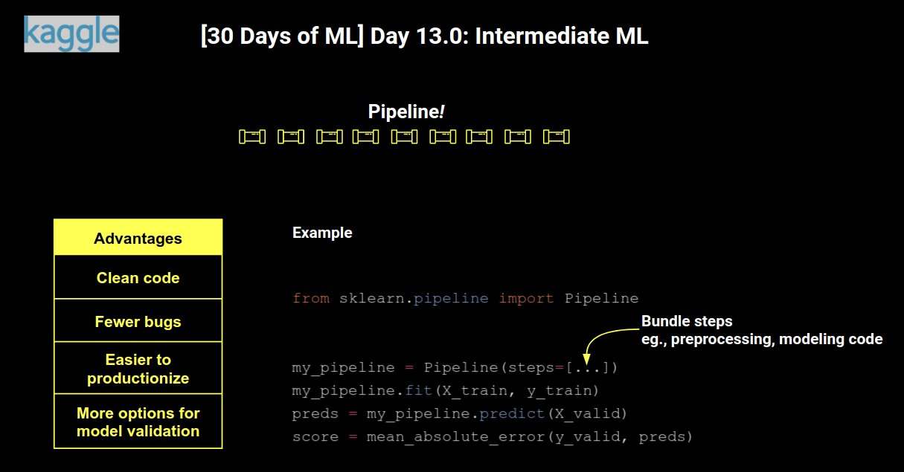

#### :point_right: [v5：NotChanged]【16721.95257】(9955／17145：Top 59％) Notebook Intermediate ML Course Exercise 4 of 7 | Version 5

- Kaggle講座「[Intermediate Machine Learning: 4 of 7： Pipelines](https://www.kaggle.com/alexisbcook/pipelines)」の演習問題に、v1～V3までに内容を反映させた。

- 数値の欠損値には「平均」戦略を、カテゴリ値の欠損値には「固定値」戦略とワンホットエンコーディングを実施した。
- テストデータにも欠損値があったので、それは平均値で補完して欠損値を埋めた。平均値の算出には全データを用いた。

  ```python
  from sklearn.impute import SimpleImputer
  from sklearn.preprocessing import OneHotEncoder
  from sklearn.pipeline import Pipeline
  from sklearn.compose import ColumnTransformer
  from sklearn.ensemble import RandomForestRegressor
  
  numerical_cols = [cname for cname in X_train_full.columns if X_train_full[cname].dtype in ['int64', 'float64']]
  categorical_cols = [cname for cname in X_train_full.columns if X_train_full[cname].nunique() < 10 and X_train_full[cname].dtype == "object"]
  
  # 数値データの変換器
  numerical_transformer = SimpleImputer(strategy='mean')
  # カテゴリデータの変換器
  categorical_transformer = Pipeline(steps=[
      ('imputer', SimpleImputer(strategy='constant')),
      ('onehot', OneHotEncoder(handle_unknown='ignore'))
  ])
  
  # 数値およびカテゴリーデータを束ねる前処理
  preprocessor = ColumnTransformer(
      transformers=[
          ('num', numerical_transformer, numerical_cols),
          ('cat', categorical_transformer, categorical_cols)
      ])
  
  # 前処理とモデリングのコードをパイプラインで束ねる
  my_pipeline = Pipeline(steps=[('preprocessor', preprocessor),
                                ('model', model)
                              ])
  
  # あとはフィット（訓練）する
  my_pipeline.fit(X_train, y_train)
  ```

- 試したいアイデア：
  1. より高度な手法とアンサンブル学習を行う。
    →　今後の解説で出てきそう。

<!--
- チーム内のコメント：
  1. 川崎：ほにゃほにゃ
    →　一色：いいね！
-->

### [20210818] :smile:6回目提出。交差検証を適用した

- 戦略：**交差検証：**
  - ホールドアウト法：データを訓練データと検証データに固定的に分割する手法。大規模なデータセットの場合（データが大量にあればそれで十分だから）
  - 交差検証： より汎化性能が高まるが、時間がかかる問題も。小規模なデータセットの場合（データが少量だと汎化性能に不安がある）
  - `from sklearn.model_selection import cross_val_score`
  - 交差検証では、個別のトレーニングセットと検証セットを追跡する必要がなくなって、コードがシンプルになる利点もある

- :arrow_down_small:図解：交差検証（画像の引用元：<https://twitter.com/AIDay95390248/status/1427398494353076225>）
  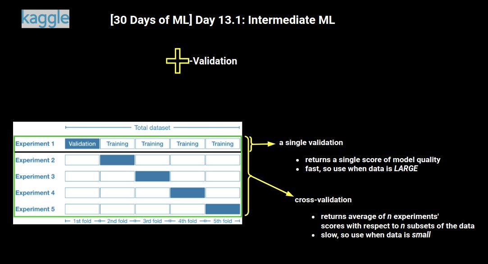

#### :+1: [v6：Improved]【16241.51793】(1246／17661：Top 8％) Notebook Intermediate ML Course Exercise 5 of 7 | Version 6

- Kaggle講座「[Intermediate Machine Learning: 5 of 7： Cross-Validation](https://www.kaggle.com/alexisbcook/cross-validation)」の演習問題に、これまでに内容を反映させた。

- 交差検証は、以下のようにパイプラインを使う方が簡単。

  ```python
  from sklearn.impute import SimpleImputer
  from sklearn.pipeline import Pipeline
  from sklearn.ensemble import RandomForestRegressor
  from sklearn.model_selection import cross_val_score

  def get_score(n_estimators):
      model = RandomForestRegressor(n_estimators=n_estimators, criterion='mae', random_state=0)
      my_pipeline = Pipeline(
          steps=[
              ('preprocessor', preprocessor),
              ('model', model)
          ])
      scores = -1 * cross_val_score(my_pipeline, X, y, cv=5, scoring='neg_mean_absolute_error')
      return scores.mean()
  
  results = {n_estimators: get_score(n_estimators) for n_estimators in range(50, 450, 50)} # 最適なパラメーターを探す
  ```

- scilit-learnの評価指標は「値が大きいほど性能が良い」という基準にしているため、交差検証のスコアリング指標を指定する`scoring`引数にMAEを指定したい場合、「neg_」が付いた`'neg_mean_absolute_error'`を使用する必要がある。負（マイナス）が掛けられた状態の値なので、最終的に`-1`を掛けて符号を逆転させる必要がある。

- 試したいアイデア：
  1. ハイパーパラメーターの自動最適化
    →　[GridSearchCV](https://scikit-learn.org/stable/modules/generated/sklearn.model_selection.GridSearchCV.html)が使える

<!--
- チーム内のコメント：
  1. 川崎：ほにゃほにゃ
    →　一色：いいね！
-->

### [20210818] :astonished:7回目提出。アンサンブル学習を適用した

- 戦略：**アンサンブル学習：**
  - ランダムフォレスト法： 決定木のアンサンブル学習
  - 勾配ブースティング法： アンサンブルにモデルを反復的に追加するサイクルを経るアンサンブル学習の手法。以下のものがscikit-learnで使える
    - [GradientBoostingRegressor](https://scikit-learn.org/stable/modules/generated/sklearn.ensemble.GradientBoostingRegressor.html)
    - [XGBRegressor](https://xgboost.readthedocs.io/en/latest/python/python_api.html)＝こちらの方が高速で優れている

- :arrow_down_small:図解：アンサンブル法（画像の引用元：<https://twitter.com/AIDay95390248/status/1427770959784812544>）
  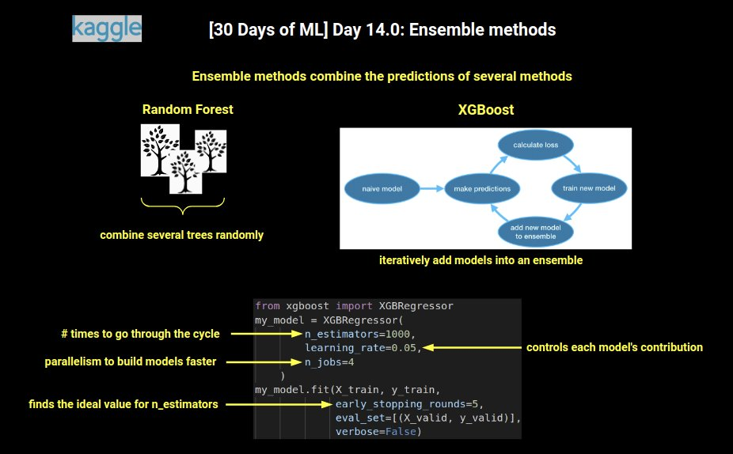

#### :+1: [v7：Improved]【14964.89501】(486／17719：Top 3％) Notebook Intermediate ML Course Exercise 6 of 7 | Version 7

- Kaggle講座「[Intermediate Machine Learning: 6 of 7： XGBoost](https://www.kaggle.com/alexisbcook/xgboost)」の演習問題に、これまでに内容を反映させた。

- ランダムフォレスト法を使用。

  ```python
  from sklearn.pipeline import Pipeline
  from sklearn.ensemble import RandomForestRegressor

  n_estimators_best = 350
  model = RandomForestRegressor(n_estimators=n_estimators_best, criterion='mae', random_state=0)
  rf_pipeline = Pipeline(steps=[('preprocessor', preprocessor), ('model', model)])

  preds_test_rf = rf_pipeline.predict(X_test)
  ```

- 勾配ブースティング法のXGBRegressorを使用。

  ```python
  from sklearn.metrics import mean_absolute_error
  from xgboost import XGBRegressor
  
  # モデルを定義
  my_model_xgb = XGBRegressor(
      random_state=0,
      n_estimators=1000, # 実行するサイクルの回数＝アンサンブルに含めるモデルの数
      learning_rate=0.04997, # 学習率。デフォルトは0.1
      n_jobs=4) # 並列処理の数（CPUコアスレッド数に合わせる。上記の通り、2x2＝4）

  # モデルを訓練（フィット）
  my_model_xgb.fit(
      X_train, y_train,
      early_stopping_rounds=5,
      eval_set=[(X_valid, y_valid)],
      verbose=False)

  # 予測を取得
  predictions_xgb = my_model_xgb.predict(X_valid)
  ```

- 2つのモデルで平均法のアンサンブル学習を実施。

```python
preds_test = (preds_test_xgb + preds_test_rf) / 2
```

- scilit-learnの評価指標は「値が大きいほど性能が良い」という基準にしているため、交差検証のスコアリング指標を指定する`scoring`引数にMAEを指定したい場合、「neg_」が付いた`'neg_mean_absolute_error'`を使用する必要がある。負（マイナス）が掛けられた状態の値なので、最終的に`-1`を掛けて符号を逆転させる必要がある。

- 試したいアイデア：
  1. ハイパーパラメーターの自動最適化
    →　[GridSearchCV](https://scikit-learn.org/stable/modules/generated/sklearn.model_selection.GridSearchCV.html)が使える

<!--
- チーム内のコメント：
  1. 川崎：ほにゃほにゃ
    →　一色：いいね！
-->

### [20210818] :astonished:目標達成のため提出なし。データ漏えいの問題を学んだ

- 戦略：**データ漏えい（Data Leakage）の回避：**
  1. ターゲットの漏えい（Target leakage）：
    例えば肺炎をターゲットに予測するのに「肺炎の薬の使用」が訓練データに含まれているなど。実際に将来予測では使えない特徴量が訓練データに含まれてしまっている。
  2. 訓練-テストの汚染（Train-Test Contamination）：
    `train_test_split()`を呼び出す前に、欠損値の前処理などを行うと、検証データを含めて訓練することになってしまう、つまり汎化性能を失うのでやってはいけない。各種フィッティングの前に検証データを除外しておくこと。交差検証では、パイプラインで前処理を行うこと。

### [20210820] :man_playing_handball:［おまけ］最終提出。清書し直して、前処理をもう少しちゃんと書いたうえで、Azure AutoMLの結果をアンサンブルで出力した

- Kaggleノートブックではなく、ローカル環境のVisual Studio CodeでJupyterノートブックを作って作業すると、3倍くらい高速になった。
- WindowsのVS Codeだと、改行がCR+LFになることがあり、そのノートブックを既存のKaggleノートブックにアップロードすると（※上書きアップロードしかできない）、改行問題でエラーになる。
  - → VS Codeで作ったKaggleワークスペース限定で`"files.eol": "\n"`を入れることで問題を回避できることを確認した。
  - 参考：[Always use LF instead of CRLF for *.ipynb files regardless of platform · Issue #4576 · microsoft/vscode-jupyter](https://github.com/microsoft/vscode-jupyter/issues/4576)

#### :+1: [v8：Improved]【14093.71916】(128／18798：Top 1％) Notebook Final model of the house price compe | Version 8

- Azure Machine LerningのAutoMLを試した。
- VotingEnsemble、StackEnsemble、XGBoostRegressor、ElasticNet、LightGBMが上位に来て、それなりに好成績になったが、v7を超えられなかった。
- 最終的には、1位のVotingEnsembleと、2位のStackEnsemble、v7のXGBoost＋ランダムフォレストの結果を平均するアンサンブル法でv7を超えたので、これで作業を完了した。

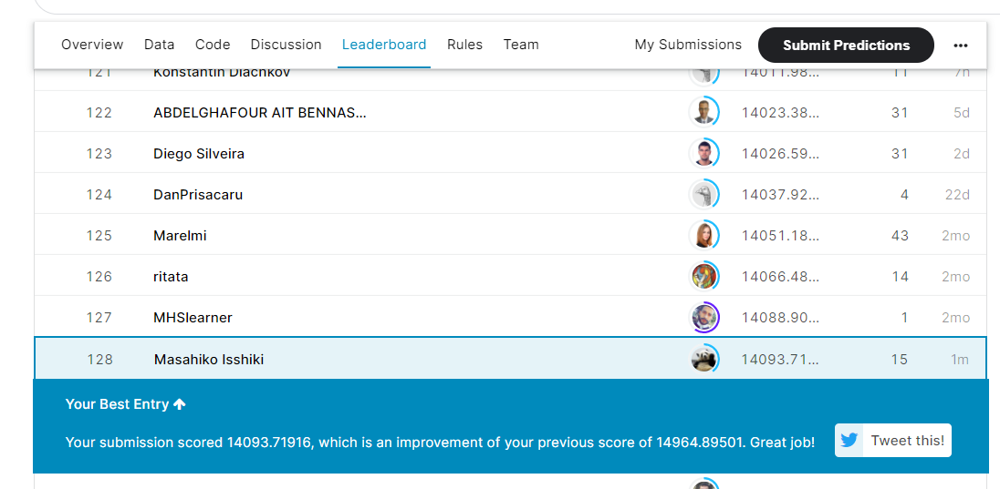

［おまけ］Azure AutoMLを使いこなす
----------------------------------

ちなみにAzure AutoMLでは、データセットの特徴量プロファイリングが行えます。

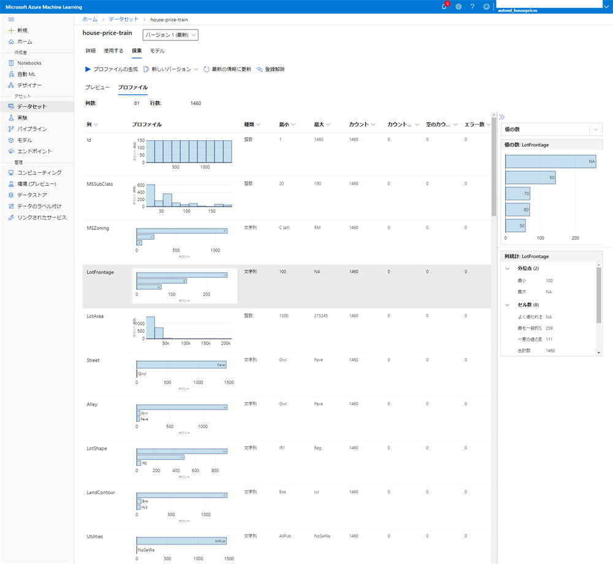

実験（機械学習）の前処理として「欠損値の補完」や「高いカーディナリティの検出」、「交差検証」を自動的に行ってくれます。


実験によって50個ほどのモデルが作成され、精度が良い順に並びます。

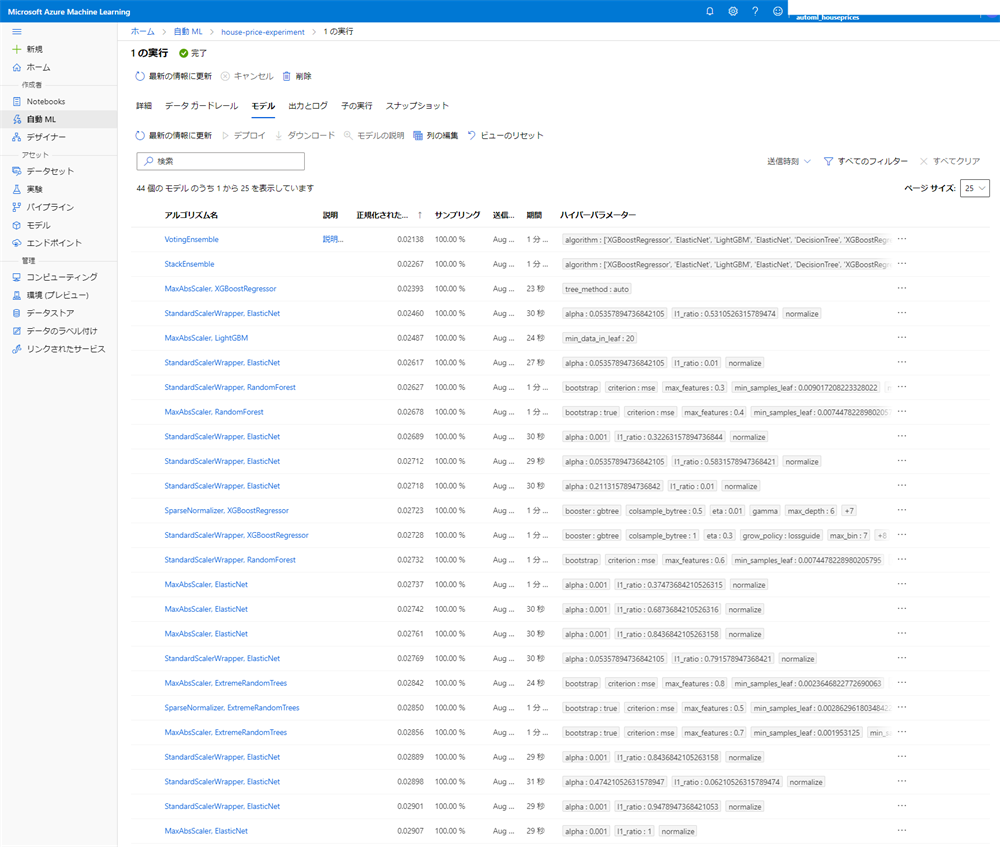

解釈性（XAI）に関する機能もあり、例えば特徴量の重要性をグラフ化したりできます。

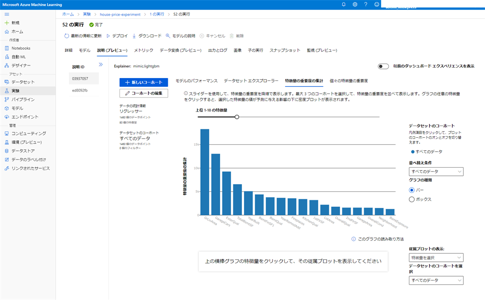

こうやって作成したモデルは、

- [チュートリアル: コードなし分類モデルを AutoML でトレーニングする - Azure Machine Learning | Microsoft Docs](https://docs.microsoft.com/ja-jp/azure/machine-learning/tutorial-first-experiment-automated-ml#deploy-the-best-model)

に従うと、デプロイしてWebサービス経由で使えます。

しかし私の場合は、ここからAzure MLノートブックで、データセットを読み込んで、モデルをロードして予測するという方法を取りました。この方法に関する情報がなくて苦労しましたが...。

情報がないというよりも便利なAPIが足りない気がします。かなり力技で行いました。ポイントのみ参考で書いておきます。

```python
best_run, fitted_model = run.get_output(metric='mean_absolute_error') 
```

最良のモデルは上記の式で簡単に取得できます。`run`を取得するのは、

- [チュートリアル: AutoML - 回帰モデルをトレーニングする - Azure Machine Learning | Microsoft Docs](https://docs.microsoft.com/ja-jp/azure/machine-learning/tutorial-auto-train-models#retrieve-the-best-model)

が参考になるはずです。問題は2位以降のモデルの取得。この説明が探してもなくて力技です。

まずモデルを登録します（※デプロイはしない）。これは次のコードで行えます。

```python
# アルゴリズム情報を取得できる
model_algos = [model_algo for model_algo in run.get_children()]

# 名前付けしてモデルを登録（未登録の場合。登録済みの場合は下を実行）
coded_model_name2 = 'AutoML02StackEnsemble'
model_path = ''#'outputs/AutoML02StackEnsemble.joblib'
registered_mode2 = model_algos[1].register_model(model_name=coded_model_name, model_path=model_path)
registered_mode2 # azureml.core.model.Modelクラス
```

fitted_model（`azureml.automl.runtime.shared.model_wrappers.RegressionPipeline`クラス）は、scikit-learnパイプラインのラッパーになっており、そのまま`predict()`が呼び出せます。しかし上記コードで登録したモデルは、`azureml.core.model.Model`クラスでパイプラインではなく、`predict()`が呼び出せません。どうすればいいのか。後で説明します。

登録したモデルは、Azure MLの［モデル］ページに表示されます。登録済みのものを取得することもできます。

```python
# 任意のモデルを取得（上の処理で登録済みの場合）
from azureml.core.model import Model
coded_model_name2 = 'AutoML02StackEnsemble'
registered_model2 = Model(workspace, name=deployed_model_name, version=1)
print('registered_model2')
registered_model2 # azureml.core.model.Modelクラス
```

こちらも`Model`クラスで、`predict()`が呼び出せません。そこで、モデルとして生成されたフォルダー内にある`model.pkl`ファイルをロードしてパイプラインのオブジェクトを取得します。それが以下のコード。かなり力技なので、このコードを外に出すのはどうかとは思うのですが、これ以外のやり方が分からなかったです。

```python
model_name = coded_model_name2 # coded_model_name ここを変える

import joblib
from azureml.core.model import Model

# モデルパスの決定
model_pkl_path = Model.get_model_path(model_name, _workspace=workspace)
if not model_pkl_path.endswith('.pkl'):
    model_pkl_path = model_pkl_path + '/outputs/model.pkl'
print(model_pkl_path)

# モデル（sklearnパイプライン）をロード
model = joblib.load(model_pkl_path)
model # azureml.automl.runtime.shared.model_wrappers.RegressionPipelineクラス
```

この状態で`predict()`が呼び出せます。そもそも`run.get_output()`で任意のモデルを取得できるか、登録後のモデルからパイプラインを取得する関数があればよいのですが、なさそうで、今後、API側が使いやすくなるのに期待するしかないのかなと思っています。

これがAzure AutoMLを使いたい人の役に立てばと思い、書きましたが、もっと良い解決法が見つかればブログにでも書こうと思っています。
