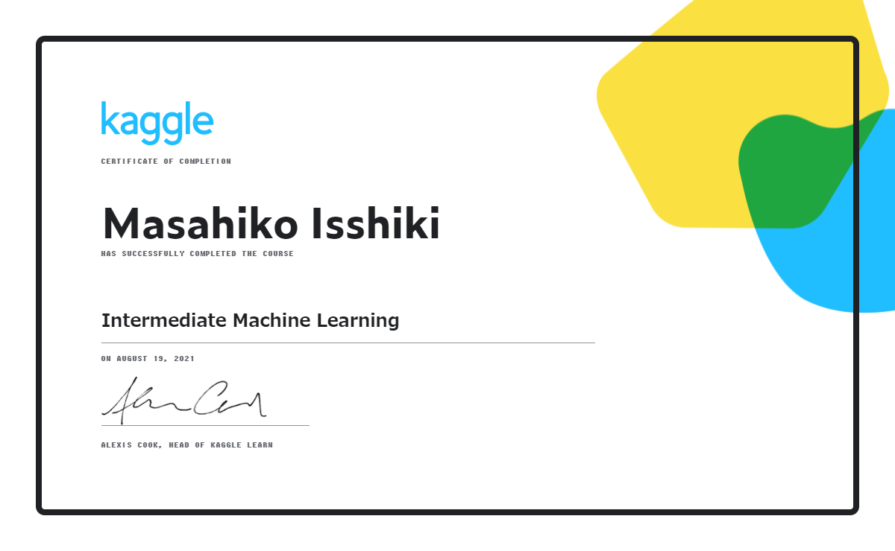
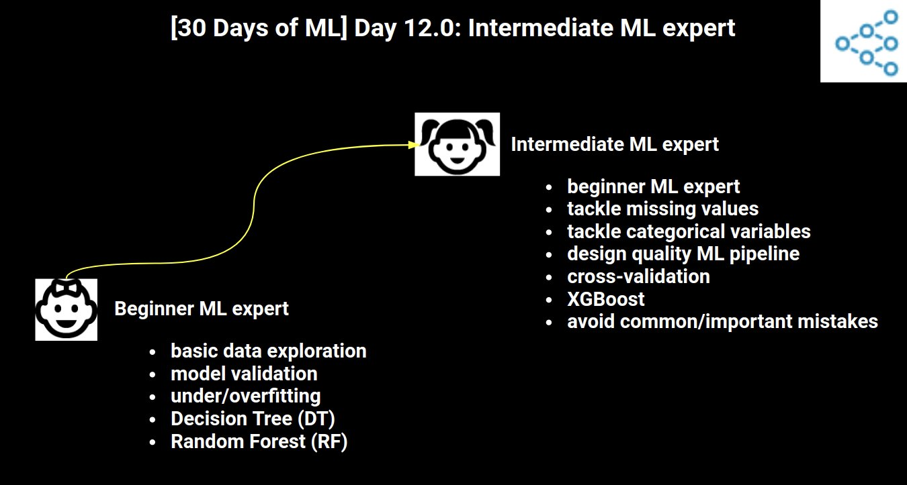
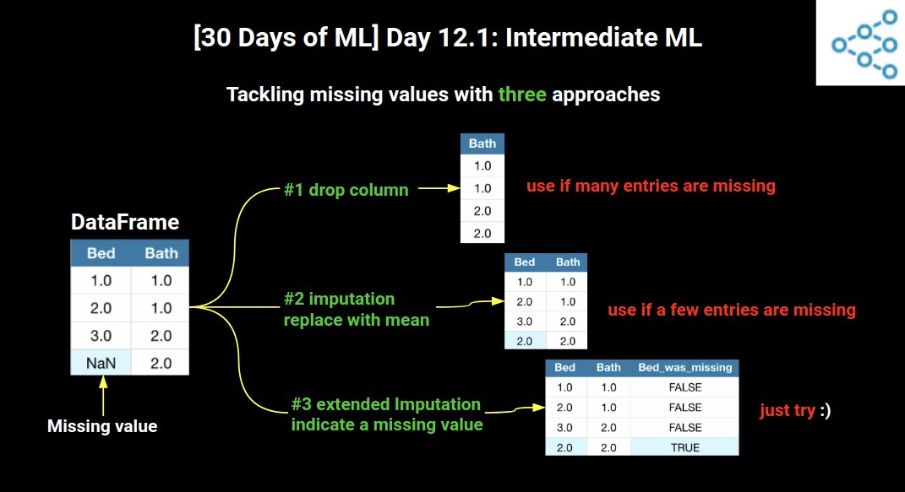
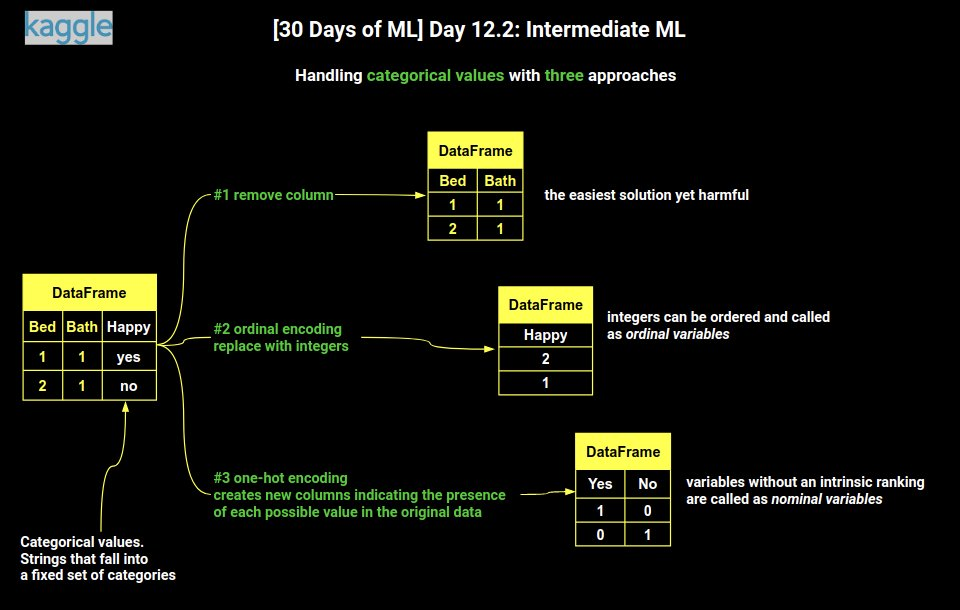
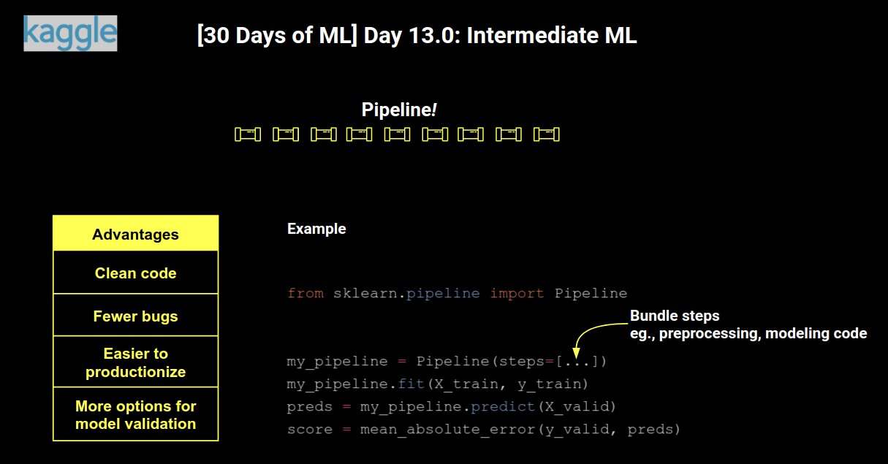
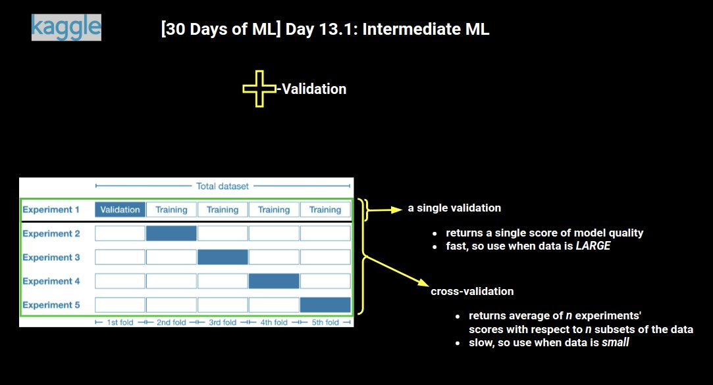
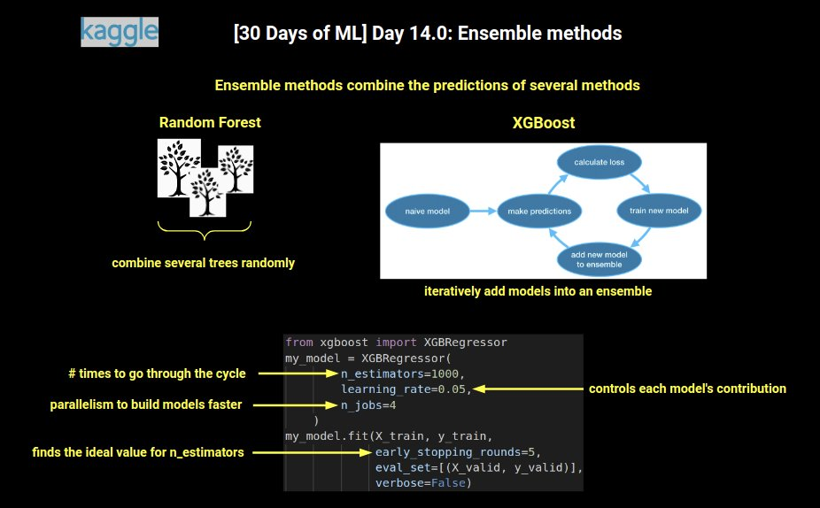

Kaggle日記（2021年8月14日～18日）： Kaggle公式講座「Intermediate Machine Learning」の履修
=========================================================================================

2021年8月2日から開催されたKaggle公式「[30 Days of ML](https://www.kaggle.com/thirty-days-of-ml)」プログラムに沿って、2週目の3日間（＋3週目の2日）で、

- 講座「[Learn Intermediate Machine Learning Tutorials | Kaggle](https://www.kaggle.com/learn/intermediate-machine-learning)」

を受講して終了しました。この日記はそのときのログです。

修了証
----------------------------------------

- [I've completed the Intermediate Machine Learning course on Kaggle!](https://www.kaggle.com/learn/certification/isshiki/intermediate-machine-learning)

  

Kaggle’s 30 Days of ML Daily Assignments
----------------------------------------

リンクはカットしました。ちょっとボリュームが多くて2日間ほど遅れました...。

- Day 12： 8/14土
  - Read this tutorial (from Lesson 1 of the Intermediate ML course)
  - Complete this exercise (from Lesson 1 of the Intermediate ML course)

- Day 13： 8/15日
  - Read this tutorial (from Lesson 2 of the Intermediate ML course)
  - Complete this exercise (from Lesson 2 of the Intermediate ML course)

- Day 14： 8/16月
  - Read this tutorial (from Lesson 3 of the Intermediate ML course)
  - Complete this exercise (from Lesson 3 of the Intermediate ML course)

- Day 15： 8/17火
  - Read this tutorial (from Lesson 4 of the Intermediate ML course)
  - Complete this exercise (from Lesson 4 of the Intermediate ML course)

- Day 16： 8/18水
  - Read this tutorial (from Lesson 5 of the Intermediate ML course)
  - Complete this exercise (from Lesson 5 of the Intermediate ML course)
  - Read this tutorial (from Lesson 6 of the Intermediate ML course)
  - Complete this exercise (from Lesson 6 of the Intermediate ML course)
  - Read this tutorial (from Lesson 7 of the Intermediate ML course)
  - Complete this exercise (from Lesson 7 of the Intermediate ML course)

Intermediate Machine Learning Course
----------------------------------------

Competitions／Datasets／Notebooks／Discussionの全カテゴリで最上位の称号（＝4GM、4x Kaggle Grandmaster）を獲得したAbhishek Thakur氏（『Kaggle Grandmasterに学ぶ 機械学習 実践アプローチ』／"Approaching (Almost) Any Machine Learning Problem"の著者）による下記の解説動画も全て視聴しました。

- [Kaggle's 30 Days of ML - YouTube](https://www.youtube.com/playlist?list=PL98nY_tJQXZnP-k3qCDd1hljVSciDV9_N)

勉強した内容を図にまとめたツイートを見付けました。

- [AI Day](https://twitter.com/AIDay95390248)

履修内容を簡単に思い出しやすいように、上記の図を以下に引用しています。

### 戦略：パラメーターを変えたモデルをいくつか作り、最適なモデルを選択

- 「モデルバリエーション」コード例：

  ```python
  from sklearn.ensemble import RandomForestRegressor

  model_1 = RandomForestRegressor(n_estimators=50, random_state=0)
  model_2 = RandomForestRegressor(n_estimators=100, random_state=0)
  model_3 = RandomForestRegressor(n_estimators=100, criterion='mae', random_state=0)
  model_4 = RandomForestRegressor(n_estimators=200, min_samples_split=20, random_state=0)
  model_5 = RandomForestRegressor(n_estimators=100, max_depth=7, random_state=0)
  ```

- :arrow_down_small:図解：初心者から中級者へ（画像の引用元：<https://twitter.com/AIDay95390248/status/1426671314803347456>）
  

### 戦略：欠損値の前処理

1. 欠損値のある変数列そのものをドロップする
2. 補完（impute）する
3. 補完したうえで「他の有無」を新たな列に追加して拡張する

- :arrow_down_small:図解：欠損値の前処理戦略（画像の引用元：<https://twitter.com/AIDay95390248/status/1426990935368478727>）
  

- 「欠損値の前処理」コード例：

  ```python
  cols_with_missing = [col for col in X.columns if X[col].isnull().any()] 
  X.drop(cols_with_missing, axis=1, inplace=True)
  X_test.drop(cols_with_missing, axis=1, inplace=True)
  ```

#### （調査結果：ある特徴で、何％ぐらいの欠損値なら許容できるか？）

- 資料：[What percentage of missing data is acceptable? – Mvorganizing.org](https://www.mvorganizing.org/what-percentage-of-missing-data-is-acceptable/)

1. 10％を超える欠損値がある分析では、バイアスが発生する可能性がある
2. 40％を超える欠損値がある分析では、仮説的なデータであると考慮すべき
3. 理論的には、20～25％が許容されうる最大の欠損値で、それを超えると分析から特徴量変数をドロップ（削除）するのを検討したい

- 結論としては、**20％を超える欠損値がある**特徴量変数は、基本的にドロップすることを検討すればよいかな

### 戦略：カテゴリ変数の前処理

1. カテゴリ変数列そのものをドロップする
2. 順序変数（Ordinal variables）に該当するなら`OrdinalEncoder`
3. 名義変数（Nominal variables）に該当するなら`OneHotEncoder`や`LabelEncoder`

- :arrow_down_small:図解：カテゴリ変数の前処理戦略（画像の引用元：<https://twitter.com/AIDay95390248/status/1427010668729937920>）
  

- 「カテゴリ変数の前処理」コード例：

  ```python
  from sklearn.preprocessing import OrdinalEncoder

  object_cols = [col for col in X_train.columns if X_train[col].dtype == "object"]
  good_label_cols = [col for col in object_cols if set(X_valid[col]).issubset(set(X_train[col]))]

  ordinal_encoder = OrdinalEncoder()
  label_X_train[good_label_cols] = ordinal_encoder.fit_transform(X_train[good_label_cols])
  label_X_valid[good_label_cols] = ordinal_encoder.transform(X_valid[good_label_cols])
  ```

### 戦略：数値とカテゴリの列を取得する前処理

1. 数値変数は型でint64かfloat64の列だけを抽出
2. カテゴリ変数は型でobjectの列だけを抽出
  ただし、その列の値のユニーク数（＝バリエーション数、カーディナリティ：**cardinality**と呼ぶ）が多すぎる（例えば15以上）と、特にOne-Hotエンコーディングで列数が増えすぎる問題があるので、10未満などに制限するとよい

- 「数値とカテゴリの列を取得する前処理」コード例：

  ```python
  numerical_cols = [cname for cname in train_data.columns if train_data[cname].dtype in ['int64', 'float64']]
  categorical_cols = [cname for cname in train_data.columns if train_data[cname].nunique() < 10 and train_data[cname].dtype == "object"]
  ```

### 戦略：パイプライン

1. よりクリーンなコード
2. バグの減少
3. プロダクト化が容易
4. モデル検証のためのより多くのオプション（交差検証など）

- `from sklearn.pipeline import Pipeline`

- :arrow_down_small:図解：sklearn.pipeline機能（画像の引用元：<https://twitter.com/AIDay95390248/status/1427389726198222866>）
  

- 「sklearnパイプライン」コード例：

  ```python
  from sklearn.impute import SimpleImputer
  from sklearn.preprocessing import OneHotEncoder
  from sklearn.pipeline import Pipeline
  from sklearn.compose import ColumnTransformer
  from sklearn.ensemble import RandomForestRegressor
  
  numerical_cols = [cname for cname in X_train_full.columns if X_train_full[cname].dtype in ['int64', 'float64']]
  categorical_cols = [cname for cname in X_train_full.columns if X_train_full[cname].nunique() < 10 and X_train_full[cname].dtype == "object"]
  
  # 数値データの変換器
  numerical_transformer = SimpleImputer(strategy='mean')
  # カテゴリデータの変換器
  categorical_transformer = Pipeline(steps=[
      ('imputer', SimpleImputer(strategy='constant')),
      ('onehot', OneHotEncoder(handle_unknown='ignore'))
  ])
  
  # 数値およびカテゴリーデータを束ねる前処理
  preprocessor = ColumnTransformer(
      transformers=[
          ('num', numerical_transformer, numerical_cols),
          ('cat', categorical_transformer, categorical_cols)
      ])
  
  # 前処理とモデリングのコードをパイプラインで束ねる
  my_pipeline = Pipeline(steps=[('preprocessor', preprocessor),
                                ('model', model)
                              ])
  
  # あとはフィット（訓練）する
  my_pipeline.fit(X_train, y_train)
  ```

### 戦略：交差検証

- ホールドアウト法：データを訓練データと検証データに固定的に分割する手法。大規模なデータセットの場合（データが大量にあればそれで十分だから）
- 交差検証： より汎化性能が高まるが、時間がかかる問題も。小規模なデータセットの場合（データが少量だと汎化性能に不安がある）
- `from sklearn.model_selection import cross_val_score`
- 交差検証では、個別のトレーニングセットと検証セットを追跡する必要がなくなって、コードがシンプルになる利点もある

- :arrow_down_small:図解：交差検証（画像の引用元：<https://twitter.com/AIDay95390248/status/1427398494353076225>）
  

- 「交差検証」コード例：
  - 交差検証は、以下のようにパイプラインを使う方が簡単。

  ```python
  from sklearn.impute import SimpleImputer
  from sklearn.pipeline import Pipeline
  from sklearn.ensemble import RandomForestRegressor
  from sklearn.model_selection import cross_val_score

  def get_score(n_estimators):
      model = RandomForestRegressor(n_estimators=n_estimators, criterion='mae', random_state=0)
      my_pipeline = Pipeline(
          steps=[
              ('preprocessor', preprocessor),
              ('model', model)
          ])
      scores = -1 * cross_val_score(my_pipeline, X, y, cv=5, scoring='neg_mean_absolute_error')
      return scores.mean()
  
  results = {n_estimators: get_score(n_estimators) for n_estimators in range(50, 450, 50)} # 最適なパラメーターを探す
  ```

  - scilit-learnの評価指標は「値が大きいほど性能が良い」という基準にしているため、交差検証のスコアリング指標を指定する`scoring`引数にMAEを指定したい場合、「neg_」が付いた`'neg_mean_absolute_error'`を使用する必要がある。負（マイナス）が掛けられた状態の値なので、最終的に`-1`を掛けて符号を逆転させる必要がある。

### 戦略：アンサンブル学習

- ランダムフォレスト法： 決定木のアンサンブル学習
- 勾配ブースティング法： アンサンブルにモデルを反復的に追加するサイクルを経るアンサンブル学習の手法。以下のものがscikit-learnで使える
  - [GradientBoostingRegressor](https://scikit-learn.org/stable/modules/generated/sklearn.ensemble.GradientBoostingRegressor.html)
  - [XGBRegressor](https://xgboost.readthedocs.io/en/latest/python/python_api.html)＝こちらの方が高速で優れている

- :arrow_down_small:図解：アンサンブル法（画像の引用元：<https://twitter.com/AIDay95390248/status/1427770959784812544>）
  

- 「ランダムフォレスト法（アンサンブル学習）」コード例：

  ```python
  from sklearn.pipeline import Pipeline
  from sklearn.ensemble import RandomForestRegressor

  n_estimators_best = 350
  model = RandomForestRegressor(n_estimators=n_estimators_best, criterion='mae', random_state=0)
  rf_pipeline = Pipeline(steps=[('preprocessor', preprocessor), ('model', model)])

  preds_test_rf = rf_pipeline.predict(X_test)
  ```

- 「勾配ブースティング法（アンサンブル学習）」コード例：

  ```python
  from sklearn.metrics import mean_absolute_error
  from xgboost import XGBRegressor
  
  # モデルを定義
  my_model_xgb = XGBRegressor(
      random_state=0,
      n_estimators=1000, # 実行するサイクルの回数＝アンサンブルに含めるモデルの数
      learning_rate=0.04997, # 学習率。デフォルトは0.1
      n_jobs=4) # 並列処理の数（CPUコアスレッド数に合わせる。上記の通り、2x2＝4）

  # モデルを訓練（フィット）
  my_model_xgb.fit(
      X_train, y_train,
      early_stopping_rounds=5,
      eval_set=[(X_valid, y_valid)],
      verbose=False)

  # 予測を取得
  predictions_xgb = my_model_xgb.predict(X_valid)
  ```

- 「平均法（アンサンブル学習）」コード例：

```python
preds_test = (preds_test_xgb + preds_test_rf) / 2
```

### 戦略：データ漏えい（Data Leakage）の回避

1. ターゲットの漏えい（Target leakage）：
  例えば肺炎をターゲットに予測するのに「肺炎の薬の使用」が訓練データに含まれているなど。実際に将来予測では使えない特徴量が訓練データに含まれてしまっている。
2. 訓練-テストの汚染（Train-Test Contamination）：
  `train_test_split()`を呼び出す前に、欠損値の前処理などを行うと、検証データを含めて訓練することになってしまう、つまり汎化性能を失うのでやってはいけない。各種フィッティングの前に検証データを除外しておくこと。交差検証では、パイプラインで前処理を行うこと。
