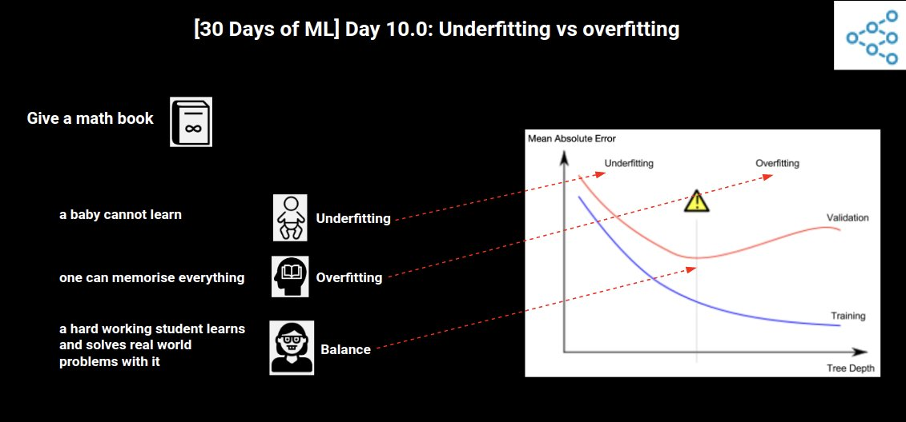

Kaggle日記（2021年8月10日～13日）： Kaggle公式講座「Intro to Machine Learning」の履修
===============================

2021年8月2日から開催されたKaggle公式「[30 Days of ML](https://www.kaggle.com/thirty-days-of-ml)」プログラムに沿って、2週目の4日間で、

- 講座「 [Learn Intro to Machine Learning Tutorials | Kaggle](https://www.kaggle.com/learn/intro-to-machine-learning)」

を受講して終了しました。この日記はそのときのログです。

修了証
----------------------------------------

- [I've completed the Intro to Machine Learning course on Kaggle!](https://www.kaggle.com/learn/certification/isshiki/intro-to-machine-learning)

  

Kaggle’s 30 Days of ML Daily Assignments
----------------------------------------

リンクはカットしました。

### Day 8: 8/10

- Read this tutorial (from Lesson 1 of the Intro to ML course)
- Read this tutorial (from Lesson 2 of the Intro to ML course)
- Complete this exercise (from Lesson 2 of the Intro to ML course)

### Day 9: 8/11

- Read this tutorial (from Lesson 3 of the Intro to ML course)
- Complete this exercise (from Lesson 3 of the Intro to ML course)
- Read this tutorial (from Lesson 4 of the Intro to ML course)
- Complete this exercise (from Lesson 4 of the Intro to ML course)

### Day 10: 8/12

- Read this tutorial (from Lesson 5 of the Intro to ML course)
- Complete this exercise (from Lesson 5 of the Intro to ML course)
- Read this tutorial (from Lesson 6 of the Intro to ML course)
- Complete this exercise (from Lesson 6 of the Intro to ML course)

### Day 11 8/13

- Read this tutorial (from Lesson 7 of the Intro to ML course)
- Complete this exercise (from Lesson 7 of the Intro to ML course)

### Python Cource

Competitions／Datasets／Notebooks／Discussionの全カテゴリで最上位の称号（＝4GM、4x Kaggle Grandmaster）を獲得したAbhishek Thakur氏（『Kaggle Grandmasterに学ぶ 機械学習 実践アプローチ』／"Approaching (Almost) Any Machine Learning Problem"の著者）による下記の解説動画も全て視聴しました。

- [Kaggle's 30 Days of ML - YouTube](https://www.youtube.com/playlist?list=PL98nY_tJQXZnP-k3qCDd1hljVSciDV9_N)

勉強した内容を図にまとめたツイートを見付けました。

- [AI Day](https://twitter.com/AIDay95390248)

履修内容を簡単に思い出しやすいように、上記の図を以下に引用しています。

- :arrow_down_small:図解：モデルがどう働くか（画像の引用元：<https://twitter.com/AIDay95390248/status/1425237443964461057>）
  

- :arrow_down_small:図解：基本的なデータ探索（画像の引用元：<https://twitter.com/AIDay95390248/status/1425548966549151749>）
  

- :arrow_down_small:図解：初めての機械学習モデル（画像の引用元：<https://twitter.com/AIDay95390248/status/1425601457584234500>）
  

- :arrow_down_small:図解：モデルの検証（画像の引用元：<https://twitter.com/AIDay95390248/status/1425905424600031236>）
  

- :arrow_down_small:図解：学習不足（Underfitting）と過学習（overfitting）（画像の引用元：<https://twitter.com/AIDay95390248/status/1425924061956354049>）
  

- :arrow_down_small:図解：ランダムフォレスト（画像の引用元：<https://twitter.com/AIDay95390248/status/1425937066815332365>）
  