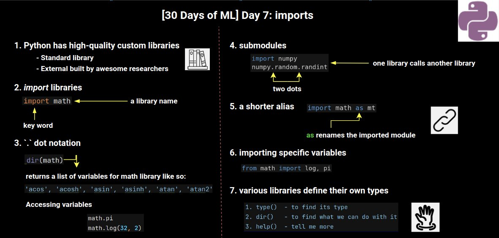

Kaggle日記（2021年8月3日～9日）： Kaggle公式講座「Python」の履修
================================================================

2021年8月2日から開催されたKaggle公式「[30 Days of ML](https://www.kaggle.com/thirty-days-of-ml)」プログラムに沿って、最初の1週間で、

- 講座「 [Learn Python Tutorials | Kaggle](https://www.kaggle.com/learn/python)」

を受講して終了しました。この日記はそのときのログです。

修了証
----------------------------------------

- [I've completed the Python course on Kaggle!](https://www.kaggle.com/learn/certification/isshiki/python)

  

Kaggle’s 30 Days of ML Daily Assignments
----------------------------------------

リンクはカットしました。

- 1日目：8月3日
  - [このノートブックの指示に従って](https://www.kaggle.com/alexisbcook/getting-started-with-kaggle) Kaggleを始める
  - 30 Days of ML の Discord コミュニティに参加し、#introductions チャンネルで自己紹介をする

- 第2日目：8月4日
  - このチュートリアルを読む（Pythonコースのレッスン1より）
  - この演習問題を解く（Pythonコースのレッスン1より）

- 3日目：8月5日
  - このチュートリアルを読む（Pythonコースのレッスン2より）
  - この演習問題を完了する（Pythonコースのレッスン2より）

- 4日目：8/6
  - このチュートリアルを読む（Pythonコースのレッスン3より）
  - この演習問題を完了する（Pythonコースのレッスン3より）

- 5日目：8月7日
  - このチュートリアルを読む（Pythonコースのレッスン4より）
  - この演習問題を完了する（Pythonコースのレッスン4より）
  - このチュートリアルを読む（Pythonコースのレッスン5より）
  - この演習問題を完了する（Pythonコースのレッスン5より）

- 6日目：8月8日
  - このチュートリアルを読む（Pythonコースのレッスン6より）
  - この演習問題を完了する（Pythonコースのレッスン6より）

- 7日目：8月9日
  - このチュートリアルを読む（Python コースのレッスン7より）
  - この演習問題を完了する（Pythonコースのレッスン7より）

Python Course
----------------------------------------

Competitions／Datasets／Notebooks／Discussionの全カテゴリで最上位の称号（＝4GM、4x Kaggle Grandmaster）を獲得したAbhishek Thakur氏（『Kaggle Grandmasterに学ぶ 機械学習 実践アプローチ』／"Approaching (Almost) Any Machine Learning Problem"の著者）による下記の解説動画も全て視聴しました。

- [Kaggle's 30 Days of ML - YouTube](https://www.youtube.com/playlist?list=PL98nY_tJQXZnP-k3qCDd1hljVSciDV9_N)

勉強した内容を図にまとめたツイートを見付けました。

- [AI Day](https://twitter.com/AIDay95390248)

履修内容を簡単に思い出しやすいように、上記の図を以下に引用しています。

- :arrow_down_small:図解：簡単に読めるPythonコード（画像の引用元：<https://twitter.com/AIDay95390248/status/1423035277489184774>）
  

- :arrow_down_small:図解：数値と算術（画像の引用元：<https://twitter.com/AIDay95390248/status/1423035281280749572>）
  

- :arrow_down_small:図解：関数とヘルプ取得（画像の引用元：<https://twitter.com/AIDay95390248/status/1423420821230559232>）
  

- :arrow_down_small:図解：真偽値（画像の引用元：<https://twitter.com/AIDay95390248/status/1423761634200375301>）
  

- :arrow_down_small:図解：条件文（画像の引用元：<https://twitter.com/AIDay95390248/status/1423764629973520388>）
  

- :arrow_down_small:図解：リスト操作 1（画像の引用元：<https://twitter.com/AIDay95390248/status/1424120246105948172>）
  

- :arrow_down_small:図解：リスト操作 2（画像の引用元：<https://twitter.com/AIDay95390248/status/1424120251776741384>）
  

- :arrow_down_small:図解：繰り返し処理（画像の引用元：<https://twitter.com/AIDay95390248/status/1424144806154997760>）
  

- :arrow_down_small:図解：文字列（画像の引用元：<https://twitter.com/AIDay95390248/status/1424487728377380864>）
  

- :arrow_down_small:図解：文字列（画像の引用元：<https://twitter.com/AIDay95390248/status/1424487728377380864>）
  

- :arrow_down_small:図解：辞書（画像の引用元：<https://twitter.com/AIDay95390248/status/1424497606839918593>）
  

- :arrow_down_small:図解：インポート（画像の引用元：<https://twitter.com/AIDay95390248/status/1424839510811201538>）
  
